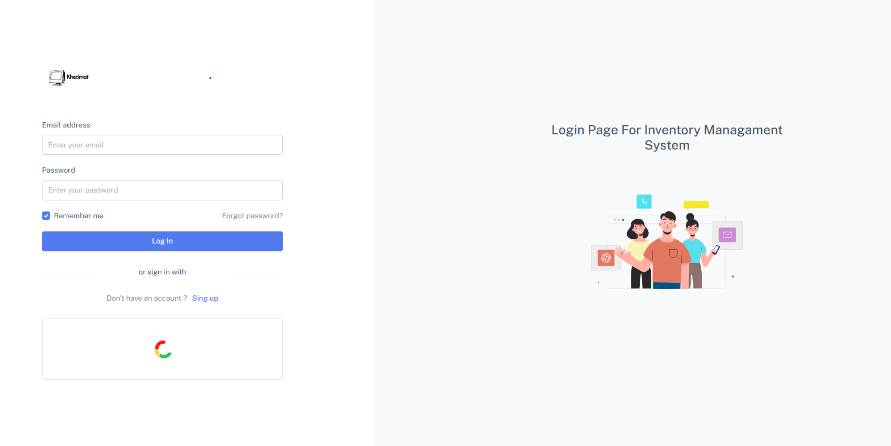
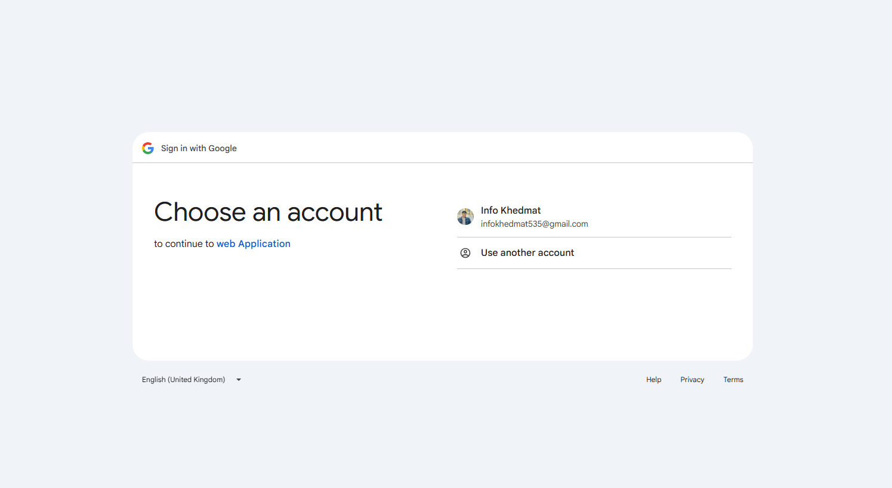
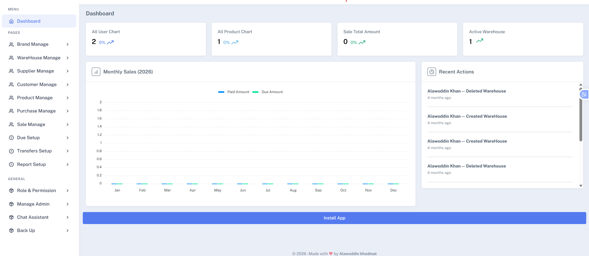
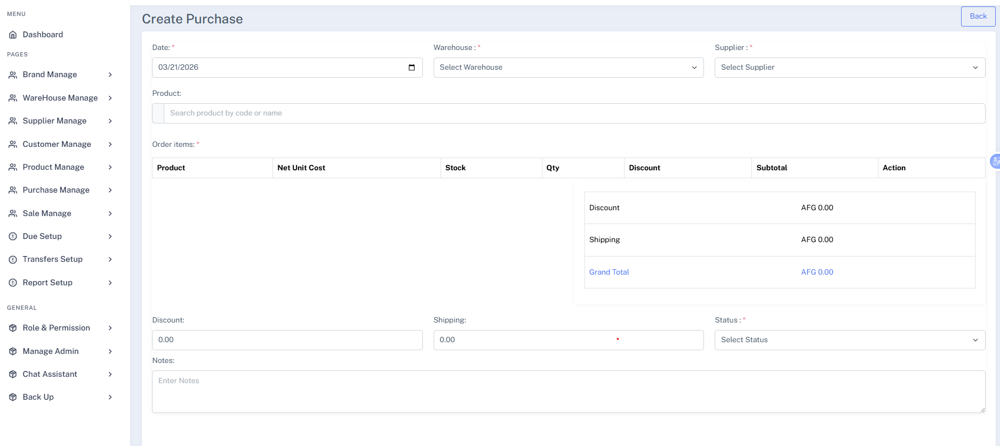
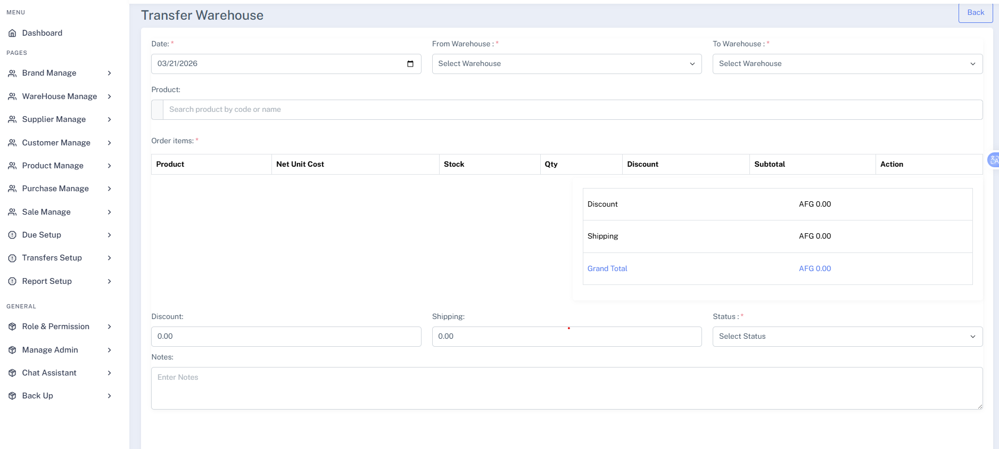
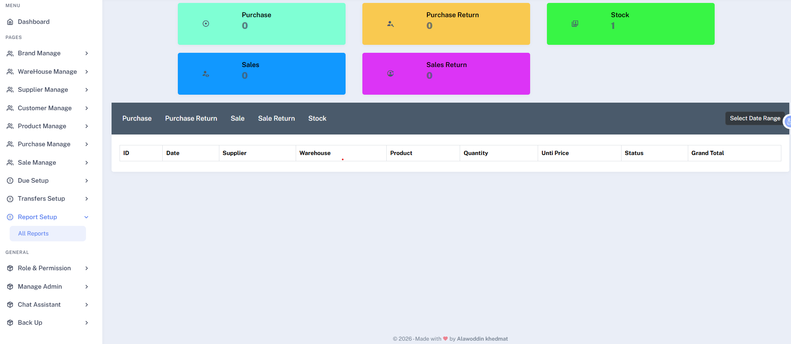
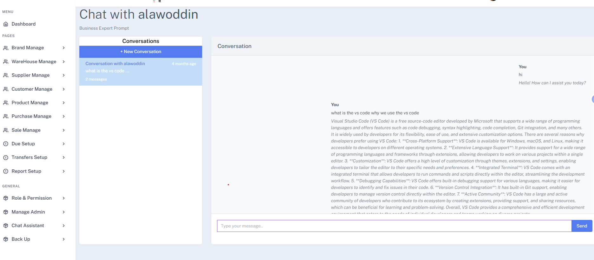
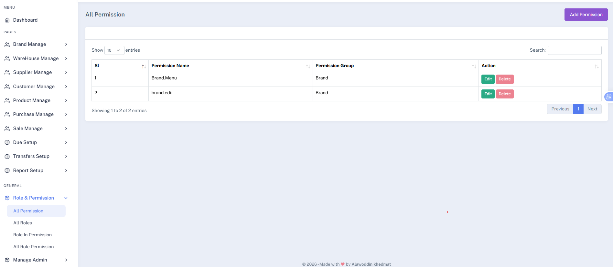
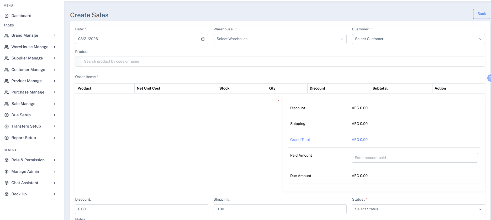

# 📦 Advanced Inventory Management System

## 📌 Overview

Advanced Inventory Management System is a robust web-based application built with Laravel and MySQL for managing products, warehouses, and business inventory operations.

This system is designed for real-world business use, featuring multi-warehouse support, purchase tracking, role-based access control, and secure authentication including social login.

---

## ✨ Key Features

### 👨‍💼 Admin Dashboard

* 📦 Manage products (Add / Update / Delete)
* 🏬 Warehouse management system
* 🔄 Transfer items between warehouses
* 💰 Purchase management with due tracking
* 📊 Generate reports and analytics
* 👥 Role & Permission management system
* 💾 Backup system for data protection

---

### 🔐 Authentication System

* Secure login and registration
* Social login integration (Google account)
* Role-based access control (Admin / User)

---

### 🏬 Warehouse & Inventory

* Multi-warehouse support
* Track stock levels per warehouse
* Transfer inventory between locations
* Monitor product availability in real-time

---

### 💵 Purchase & Financial System

* Record product purchases
* Track payment status (paid / due)
* Manage supplier-related transactions (if applicable)

---

### ⚡ Core Features

* Real-time inventory tracking
* Clean and scalable database design
* Secure authentication system
* Business-level logic implementation

---

## 🛠 Tech Stack

* **Backend:** Laravel (PHP)
* **Frontend:** Blade Templates
* **Database:** MySQL
* **Authentication:** Laravel Auth + Google OAuth
* **Authorization:** Role & Permission System
* **Version Control:** Git & GitHub

---

## 📷 Screenshots

### 🔹 Admin Login Page



### 🔹 Admin Login With Google Account




### 🔹 Dashboard



### 🔹 Purchase Management



### 🔹 Transfer Between Warehouses



### 🔹 Report System



### 🔹 Chat Assistants System



### 🔹 Role and permission System



### 🔹 Sale



---

## 🔗 Live Demo

👉 http://127.0.0.1:8000/

---

## Installed Packages

The following Laravel packages are used in this project:

📄 barryvdh/laravel-dompdf — Generate PDF reports
💾 spatie/laravel-backup — Automated database & file backups
🖼 intervention/image — Image processing and manipulation
🤖 openai-php/laravel — OpenAI API integration
🔐 laravel/socialite — Social login (Google authentication)
🕒 spatie/laravel-activitylog — Track user activity and system logs

## Install Dependencies

Run the following commands:

composer require barryvdh/laravel-dompdf
composer require spatie/laravel-backup
composer require intervention/image
composer require openai-php/laravel
composer require laravel/socialite
composer require spatie/laravel-activitylog


## ⚙️ Installation


### 1️⃣ Clone the repository

```bash id="inv1"
git clone https://github.com/alawoddin/InventorySystem.git
cd inventory-system
```

### 2️⃣ Install dependencies

```bash id="inv2"
composer install
npm install
```

### 3️⃣ Setup environment

```bash id="inv3"
cp .env.example .env
php artisan key:generate
```

### 4️⃣ Configure database

```env id="inv4"
DB_DATABASE=your_database
DB_USERNAME=root
DB_PASSWORD=
```

### 5️⃣ Run migrations

```bash id="inv5"
php artisan migrate
```

### 6️⃣ Run the application

```bash id="inv6"
php artisan serve
npm run dev
```

---

## 🎯 Use Cases

* Retail businesses
* Warehouses & distribution centers
* Inventory-heavy companies
* Multi-location stock management

---

## 🚀 Future Improvements

* Barcode & QR code scanning
* Supplier management system
* Export reports (PDF / Excel)
* Notification system (low stock alerts)
* Multi-user collaboration

---

## 👨‍💻 Author

**Alawoddin Khedmat**
Full-Stack Laravel Developer

🔗 GitHub: https://github.com/alawoddin

---

## 📄 License

This project is open-source and available under the MIT License.
